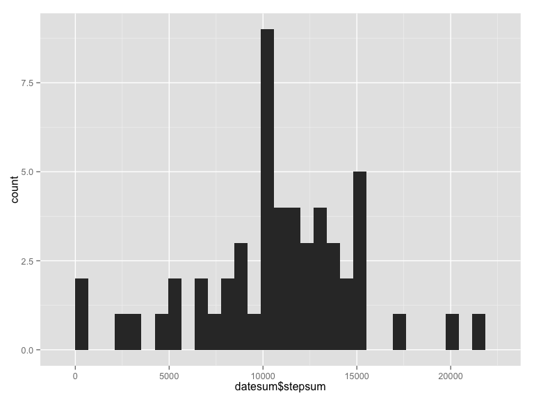
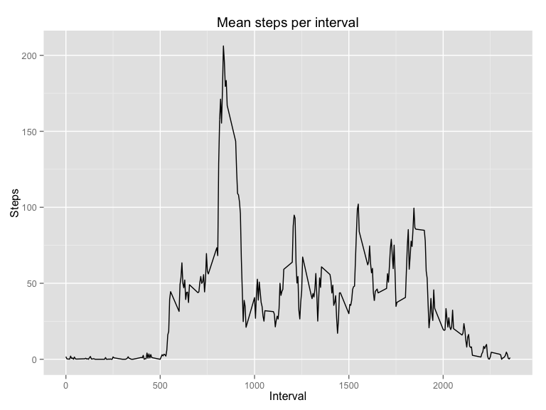
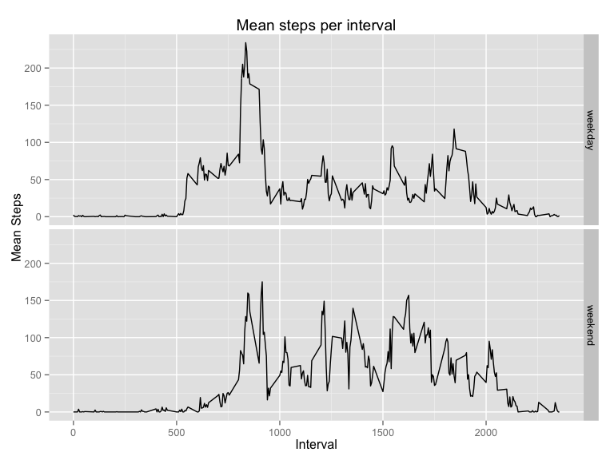

# Reproducible Research: Peer Assessment 1
## Initial Note
In the interest of full disclosure, I completed most of this assignment during a previous attempt at the class in June. Something came up at work and I didn't finish at that point, so I have made minor updates to my previous submission, as I'm retaking the class now that I have more time. I include this note to explain why my git repository has some submissions from June.

## Some initial settings
These suppress warning and messages that the packages spit out, set figure sizes, and make sure that everything is echoed

```r
knitr::opts_chunk$set(fig.width=8, fig.height=6,
                      echo=TRUE, warning=FALSE, message=FALSE, cache.path = "cache/", fig.path = "figure/")
```

## Loading and preprocessing the data
The first step for this analysis is reading in the activity data:


```r
activity <- read.csv("activity.csv")
```

Load packages I'll use

```r
library(lubridate)
library(ggplot2)
library(dplyr)
```

The date variable needs to be converted to a data data type


```r
activity$date <- ymd(activity$date)
```

## What is mean total number of steps taken per day?
To find the total number of steps taken per day, I use dplyr to find the sum of steps for each day. I then make a histogram to see the distribution of the number of steps per day. By omitting the NA's at the outset, I avoid the issue of having days with all NA values show up as having 0 steps on the histogram, since summing over only NA's yields 0.


```r
# sum of steps within days
dategroup <- group_by(na.omit(activity), date)
datesum <- summarize(dategroup, stepsum = sum(steps))

# Make the histogram
qplot(datesum$stepsum, geom = "histogram")
```

 

The mean and median of this distribution are the following


```r
# report the mean and median
mean(datesum$stepsum)
```

```
## [1] 10766.19
```

```r
median(datesum$stepsum)
```

```
## [1] 10765
```

## What is the average daily activity pattern?
We now want to switch from averaging within days to averaging over days, but within each 5 minute interval. So the first step is to find the average number of steps taken per interval, over all days. Even though there are no intervals that are always NA, for consistency with the previous analysis I omit the NA's early, rather than take the mean with na.rm = TRUE, which would yield the same results


```r
intgroup <- group_by(na.omit(activity), interval)
intervalmean <- summarize(intgroup, intm = mean(steps))

# Make the plot
qplot(intervalmean$interval, intervalmean$intm, geom = "line") +
        ylab("Steps") + xlab("Interval") + ggtitle("Mean steps per interval")
```

 

From the graph, we can see that the largest mean is near interval 800. We can find the specific interval with the highest mean activity


```r
intervalmean$interval[which(intervalmean$intm == max(intervalmean$intm))]
```

```
## [1] 835
```

## Imputing missing values

First, calculate how many NAs there are. I use colSums here to make sure the NA's are all in the steps column, and there's not anything weird going on with dates or intervals


```r
colSums(is.na(activity))
```

```
##    steps     date interval 
##     2304        0        0
```

I will fill the missing steps values with the mean steps for that interval over time. I choose this over the mean per day because the time of day has such a clear impact on the number of steps taken, as seen in the previous figure. For example, I wouldn't want to fill NA's during sleep with the daily mean. Save this as a new dataset, imputedActivity.


```r
imputedActivity <- mutate(intgroup, imputedSteps = 
                        ifelse(is.na(steps), mean(steps, na.rm = TRUE), steps))
```

Make a histogram of the total steps taken per day and report the mean and median. This is the same analysis as part one, but using the newly imputed steps


```r
# sum of steps within days
impdate <- group_by(imputedActivity, date)
impsum <- summarize(impdate, stepsum = sum(imputedSteps))

# Make the histogram
qplot(impsum$stepsum, geom = "histogram")
```

 

Calculate the mean and median

```r
mean(impsum$stepsum)
```

```
## [1] 10766.19
```

```r
median(impsum$stepsum)
```

```
## [1] 10765
```

The mean remains unchanged (which has to be the case, since I replaced the NA's with means). The median increases slightly, because the mean was larger than the median, so adding more observations with the mean value raises the median.

## Are there differences in activity patterns between weekdays and weekends?

Make a factor for weekends and weekdays


```r
imputedActivity <- mutate(imputedActivity, weekend =
                                  ifelse(weekdays(date)=="Sunday" | weekdays(date) == "Saturday",
                                         "weekend", "weekday"))
                                         
imputedActivity$weekend  <- as.factor(imputedActivity$weekend)
```

Now, I want to sum the steps over the intervals, but within the weekend factor


```r
weekInt <- group_by(imputedActivity, weekend, interval)
weekMean <- summarize(weekInt, mSteps = mean(imputedSteps))
```

Plot the mean number of steps per interval, split between weekend and weekdays


```r
ggplot(weekMean, aes(x = interval, y = mSteps)) +
        geom_line() + facet_grid(weekend ~.)+
        labs(x = "Interval", y = "Mean Steps", title = "Mean steps per interval")
```

 
